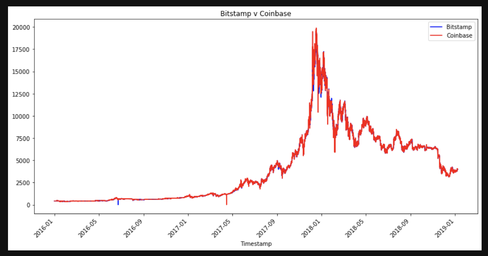

# Bitcoin Arbitrage Analysis

If you're seeking an analyst role at a high-tech investment firm, this analysis is for you! 

The task is to apply the 3 phases of financial analysis to determine if any arbitrage opportunities exist for Bitcoin. You'll be sorting through historical trade data for Bitcoin on two exchanges: Bitstamp and Coinbase. As Bitcoin trades on markets across the globe, you'll be able to capitalize on simultaneous price dislocations in those markets by using the powers of Pandas. 

---

## Technologies

This project leverages python 3.7 with the following packages:

* [pandas](https://pandas.pydata.org/) - For data cleaning, preparation and manipulation

---

## Installation Guide

Download Anaconda for your operating system and the latest Python version, run the installer, and follow the steps.

---

## Usage

After collecting and preparing the data, one of the first visualations you'll see is one of Bitstamp and Coinbase being overlayed over the full length of the dataset. 

You will then take a closer look at an early date in the dataset, dating back to 2016, which will result in the following visualization. 

Your last visualization will be one of a later date, specifically in 2018. You will notice that the spread has narrowed down as time has progressed, and both exchanges are more closely aligned, which means that there is less opportunity to generate a profit as bitcoin matures over time. 

Change the dates around and find out what the potential profits were made on certain days. Present this in an interview and the hiring manager will be wondering where you've been all their life! 

---

## Contributors

Brought to you by Edgar Coronado.

---

## License

MIT